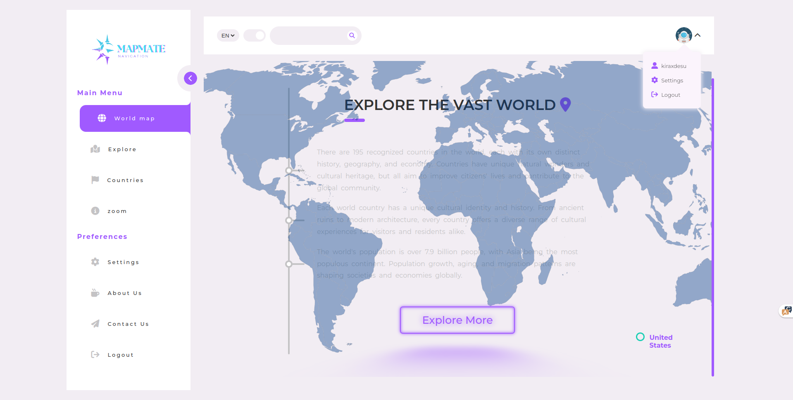

# mapmate

## Description
"mapmate" is a web application that provides access to a world countries database and offers several features, including weather information, current time/timezone details, and country-specific data visualization on a world map.

## Features
- **Get World Weather**: Obtain current weather information for countries and around the world.
- **Get Current Time / Timezone**: Discover the current time and timezone details for various locations globally.
- **Country Details**: Retrieve comprehensive information about countries, including population, capital, currency, language, and more.
- **World Map Visualization**: Explore a world map with interactive markers for each country, allowing you to access additional information and weather/time details.

## Screenshots
Here are some screenshots of the "mapmate" web application:


*Home page*


*navigation*


*time and weather*


*search*


*countries*


*search*


*details*


*settings*


*about us*


*contactus*


*update country details*

## Usage
1. Clone this repository to your local machine.
2. Install the required dependencies.
3. Run the application using your preferred web server or development environment.
4. Access the web app through your browser.

## Installation
1. Clone the repository:
   ```bash
   git clone https://github.com/kiraXdesu/mapmate.git
